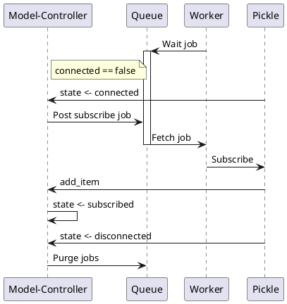
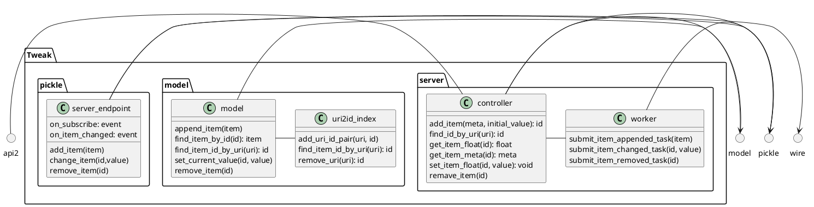
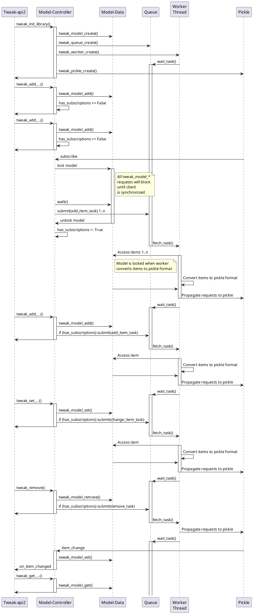
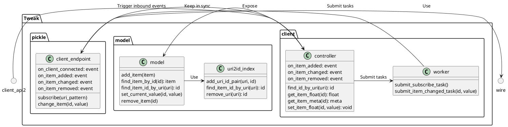
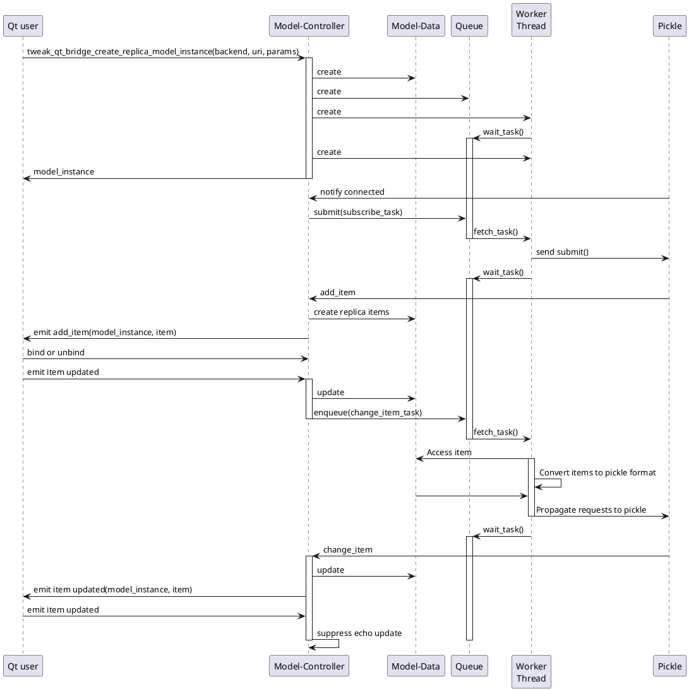

<!--
Copyright (c) 2018-2020 Cogent Embedded, Inc. ALL RIGHTS RESERVED.

The source code contained or described herein and all documents related to the
# source code("Software") or their modified versions are owned by
# Cogent Embedded, Inc. or its affiliates.
#
# No part of the Software may be used, copied, reproduced, modified, published,
# uploaded, posted, transmitted, distributed, or disclosed in any way without
# prior express written permission from Cogent Embedded, Inc.
#
# Cogent Embedded, Inc. grants a nonexclusive, non-transferable, royalty-free
# license to use the Software to Licensee without the right to sublicense.
# Licensee agrees not to distribute the Software to any third-party without
# the prior written permission of Cogent Embedded, Inc.
#
# Unless otherwise agreed by Cogent Embedded, Inc. in writing, you may not remove
# or alter this notice or any other notice embedded in Software in any way.
#
# THE SOFTWARE IS PROVIDED "AS IS", WITHOUT WARRANTY OF ANY KIND, EXPRESS OR
# IMPLIED, INCLUDING BUT NOT LIMITED TO THE WARRANTIES OF MERCHANTABILITY,
# FITNESS FOR A PARTICULAR PURPOSE AND NON-INFRINGEMENT. IN NO EVENT SHALL THE
# AUTHORS OR COPYRIGHT HOLDERS BE LIABLE FOR ANY CLAIM, DAMAGES OR OTHER
# LIABILITY, WHETHER IN AN ACTION OF CONTRACT, TORT OR OTHERWISE, ARISING FROM,
# OUT OF OR IN CONNECTION WITH THE SOFTWARE OR THE USE OR OTHER DEALINGS IN
# THE SOFTWARE.
-->

## Server connection state tracker

```plantuml
@startuml
participant "API"
participant "Model-Controller"
participant "Item indices"
participant "Item storage"
participant "Queue"
participant "Worker"
participant "Pickle"

"Worker"->"Queue"++: Wait job
note right of "Model-Controller": connected == false
"API" -> "Model-Controller": add_item
"Model-Controller"->"Item indices": Acquire write lock
"Model-Controller"->"Model-Controller": add item and update indices
note right of "Model-Controller": add requests aren't\npropagated to Queue unless\nconnected == true
"Model-Controller"->"Item indices": Release write lock
"Model-Controller"->"API"

"API" -> "Model-Controller": copy_item
"Model-Controller"->"Item indices": Acquire read lock
"Model-Controller"->"Model-Controller": Lookup index and get item reference
"Model-Controller"->"Item storage": Acquire lock
"Model-Controller"->"Item storage": Copy item value
"Model-Controller"->"Item storage": Release lock
"Model-Controller"->"Item indices": Release read lock
"API" <- "Model-Controller": Pass item ownership

"API" -> "Model-Controller": replace_item
"Model-Controller"->"Item indices": Acquire read lock
"Model-Controller"->"Model-Controller": Lookup index, find item
"Model-Controller"->"Item storage": Acquire lock
"Model-Controller"->"Item storage": Replace item value
"Model-Controller"->"Item storage": Release lock
"Model-Controller"->"Model-Controller": Check connected status
note right of "Model-Controller": Change requests aren't\npropagated to Queue unless connected == true

"Model-Controller"->"Item indices": Release read lock

"Model-Controller"->"Model-Controller": Release previous item value
"API" <- "Model-Controller"

"API" -> "Model-Controller": remove_item
"Model-Controller"->"Item indices": Acquire write lock
"Model-Controller"->"Model-Controller": remove item, free memory and update indices
note right of "Model-Controller": remove requests aren't\npropagated to Queue unless\nconnected == true
"Model-Controller"->"Item indices": Release write lock
"Model-Controller" -> "API"

== Failed connect attempt ==

"Pickle"->"Model-Controller" : Subscribe request
note right of "Model-Controller": connected <- true
"Model-Controller"->"Queue": Post subscribe job
"Queue"->"Worker"--: Fetch job
activate "Worker"
"Worker"->"Item indices": Acquire read lock
"Worker"->"Item storage": Acquire lock
"Worker"->"Model-Controller": Fetch item
"Worker"->"Worker": Prepare request
"Worker"->"Item storage": Release lock
"Worker"->"Pickle": Send request
"Worker"->"Worker": Fetch next job
"Worker"->"Item storage": Acquire lock
"Worker"->"Model-Controller": Fetch item
"Worker"->"Worker": Prepare request
"Worker"->"Item storage": Release lock
"Worker"->"Pickle": Send request
"Worker"->"Worker": Fetch next job
...
"API" -> "Model-Controller": replace_item
"Model-Controller"->"Item indices": Acquire read lock
"Model-Controller"->"Model-Controller": Lookup index, find item
"Model-Controller"->"Item storage": Acquire lock
"Model-Controller"->"Item storage": Replace item value
"Model-Controller"->"Item storage": Release lock
"Model-Controller"->"Model-Controller": Check connected status
note right of "Model-Controller": Assuming that Queue is empty\nupon subscription and have enough slots to\npostpone change requests until subscription is complete
"Model-Controller"->"Queue": Post change job
"Model-Controller"->"Item indices": Release read lock
"Model-Controller"->"Model-Controller": Release previous item value
"API" <- "Model-Controller"
"API" -> "Model-Controller": add or remove item
"Model-Controller"-> "Item indices": Acquire write lock
activate "Item indices"
"Pickle"->"Model-Controller" : Disconnected
note right of "Model-Controller": connected <- false
"Model-Controller"->"Queue": Empty queue
"Worker"->"Model-Controller": Fetch item
"Worker"->"Worker": Prepare request
"Worker"->"Item storage": Release lock
"Worker"->"Pickle": Send request
"Pickle"->"Worker": RPC operation failed
"Worker"->"Worker": Skipping remaining add_item requests
"Worker"->"Item indices": Release read lock
deactivate "Worker"
"Worker"->"Queue"++: Wait job
"Item indices"->"Model-Controller": Got write access to model data
deactivate "Item indices"
"Model-Controller"->"Model-Controller": Create new item, update indices
"Model-Controller"->"Model-Controller": Check connected status
note right of "Model-Controller": Add/Remove requests aren't\npropagated to Queue unless connected == true
"Model-Controller"->"Item indices": Release write lock
"Model-Controller"->"API"

== Client connected==

"Pickle"->"Model-Controller" : Subscribe request
note right of "Model-Controller": connected <- true
"Model-Controller"->"Queue": Post subscribe job
"Queue"->"Worker"--: Fetch job
activate "Worker"
"Worker"->"Item indices": Acquire read lock
"Worker"->"Item storage": Acquire lock
"Worker"->"Model-Controller": Fetch item
"Worker"->"Worker": Prepare request
"Worker"->"Item storage": Release lock
"Worker"->"Pickle": Send request
"Worker"->"Worker": Fetch next job
"Worker"->"Item storage": Acquire lock
"Worker"->"Model-Controller": Fetch item
"Worker"->"Worker": Prepare request
"Worker"->"Item storage": Release lock
"Worker"->"Pickle": Send request
"Worker"->"Worker": Fetch next job
...
"API" -> "Model-Controller": replace_item
"Model-Controller"->"Item indices": Acquire read lock
"Model-Controller"->"Model-Controller": Lookup index, find item
"Model-Controller"->"Item storage": Acquire lock
"Model-Controller"->"Item storage": Replace item value
"Model-Controller"->"Item storage": Release lock
"Model-Controller"->"Model-Controller": Check connected status
note right of "Model-Controller": Assuming that Queue is empty\nupon subscription and have enough slots to\npostpone change requests until subscription is complete
"Model-Controller"->"Queue": Post change job
"Model-Controller"->"Item indices": Release read lock
"Model-Controller"->"Model-Controller": Release previous item value
"API" <- "Model-Controller"
"API" -> "Model-Controller": add or remove item
"Model-Controller"-> "Item indices": Acquire write lock
activate "Item indices"
"Worker"->"Worker": Last job
deactivate "Worker"
"Worker"->"Item indices": Release read lock
"Item indices" -> "Model-Controller"
deactivate "Item indices"
"Model-Controller"->"Model-Controller": Create new item, update indices
"Model-Controller"->"Model-Controller": Check connected status
"Model-Controller"->"Queue": Post add_item job
"Model-Controller"->"Item indices": Release write lock
"Model-Controller"->"API"
== Client subscribed ==
"Worker"->"Queue" ++: Fetch jobs
"API" -> "Model-Controller": add_item
"Model-Controller"->"Item indices": Acquire write lock
"Model-Controller"->"Queue": Post add item job
"Model-Controller"->"Item indices": Release write lock
"Model-Controller"->"API"

"API" -> "Model-Controller": replace_item
"Model-Controller"->"Item indices": Acquire read lock
"Model-Controller"->"Model-Controller": Lookup index, find item
"Model-Controller"->"Item storage": Acquire lock
"Model-Controller"->"Item storage": Replace item value
"Model-Controller"->"Item storage": Release lock
"Model-Controller"->"Queue": Post change item job
"Model-Controller"->"Item indices": Release read lock
"Model-Controller"->"Model-Controller": Release previous item value
"API" <- "Model-Controller"

"Queue"->"Worker"--: Job batch
activate "Worker"
"Worker"->"Worker": Prepare pickle requests
"Worker"->"Pickle": Perform requests
deactivate "Worker"

"Worker"->"Queue" ++: Fetch jobs
"API" -> "Model-Controller": remove_item
"Model-Controller"->"Item indices": Acquire write lock
"Model-Controller"->"Model-Controller": remove item, free memory and update indices
"Model-Controller"->"Queue": Post remove item job
"Queue"->"Worker"--: Job batch
activate "Worker"
"Worker"->"Worker": Prepare pickle requests
"Worker"->"Pickle": Perform requests
deactivate "Worker"
"Model-Controller"->"Item indices": Release write lock
"Model-Controller"->"API"

== Server return to standalone mode ==

note right of "Model-Controller": connected <- false

@enduml
```

## Client connection state tracker

# Doesn't comply, have to be reworked

## Initialization sequence (Board, Tweak-api2 user).

## Client components.

## Initialization sequence (Client).

