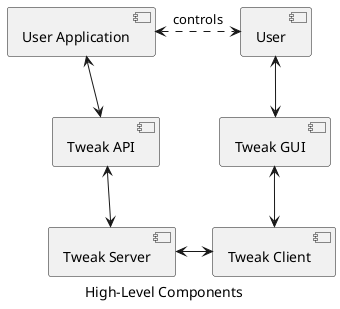
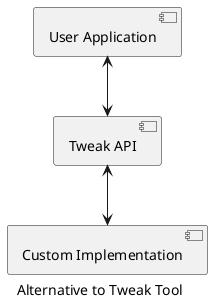
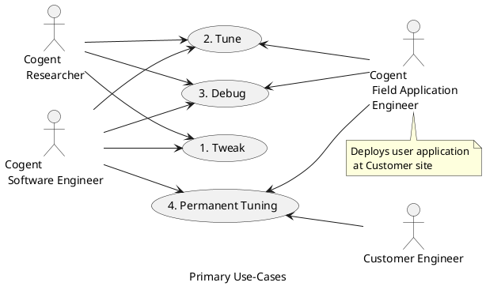
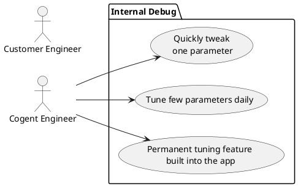
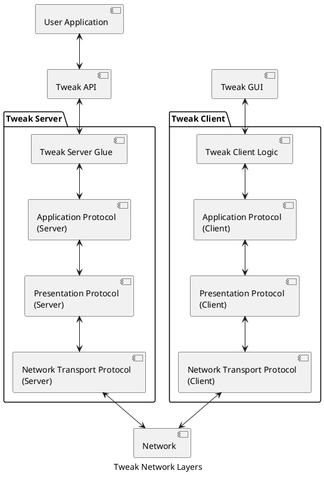
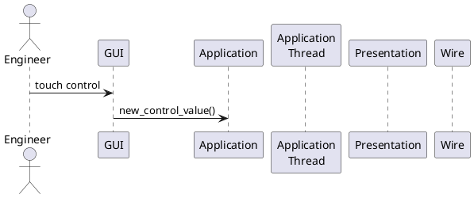

<!--
Copyright (c) 2018-2020 Cogent Embedded Inc. ALL RIGHTS RESERVED.

The source code contained or described herein and all documents related to the
# source code("Software") or their modified versions are owned by
# Cogent Embedded Inc. or its affiliates.
#
# No part of the Software may be used, copied, reproduced, modified, published,
# uploaded, posted, transmitted, distributed, or disclosed in any way without
# prior express written permission from Cogent Embedded Inc.
#
# Cogent Embedded Inc. grants a nonexclusive, non-transferable, royalty-free
# license to use the Software to Licensee without the right to sublicense.
# Licensee agrees not to distribute the Software to any third-party without
# the prior written permission of Cogent Embedded Inc.
#
# Unless otherwise agreed by Cogent Embedded Inc. in writing, you may not remove
# or alter this notice or any other notice embedded in Software in any way.
#
# THE SOFTWARE IS PROVIDED "AS IS", WITHOUT WARRANTY OF ANY KIND, EXPRESS OR
# IMPLIED, INCLUDING BUT NOT LIMITED TO THE WARRANTIES OF MERCHANTABILITY,
# FITNESS FOR A PARTICULAR PURPOSE AND NON-INFRINGEMENT. IN NO EVENT SHALL THE
# AUTHORS OR COPYRIGHT HOLDERS BE LIABLE FOR ANY CLAIM, DAMAGES OR OTHER
# LIABILITY, WHETHER IN AN ACTION OF CONTRACT, TORT OR OTHERWISE, ARISING FROM,
# OUT OF OR IN CONNECTION WITH THE SOFTWARE OR THE USE OR OTHER DEALINGS IN
# THE SOFTWARE.
-->

# Requirements

## Terms and Definitions

* Components:
   1. Server - embeddable as static library or C99 source code portion that connects to the application we want to tweak. Keep it as simple as possible.
   2. Client - GUI / Web application that allows human user to tweak parameters

Tweak API is universal and instead of Tweak Server we can use alternative custom implementations:

TODO: Add proxy for Tweak API

## Use Cases

In all cases Tweak Tool is expected to be faster to integrate than custom GUI. Its use-cases can be classified into following categories:

#### 1. Tweak
Tweak one parameter quickly when urgently needed. Minimal integration and setup time is expected. Everything shall work 'out of the box' within 15 minutes from knowing nothing about tweak tool to tweaking one parameter. No extra functionality is needed.

Examples:
- Select optimal value for an algorithm parameter without rebuild e.g. threshold
- Try some random values manually without rebuild

#### 2. Tune
Tune several parameters of simple structure in a modular complicated software (like utest or libsv). Some setup time is expected (30 min) until frustration point is reached.  Rich functionality is expected (network, config saving etc). Integration is typically temporary and not delivered to the Customer.

Examples:
- Tune views and mesh parameters
- Tune image quality parameters
- Tune calibration
- Tune algorithm parameters
- Tune GUI elements

#### 3. Debug
Debug of a an application requires: activating log level, toggling debug features and viewing internal state.  This is typically done with command-line options and log output but it is hard to use (grep requires restart for example, dlt is slow etc). Rich functionality is expected (plotting parameters on a graph, config save / reload, radio buttons). Integration is permanent, in dormant state until needed, delivered to the Customer.

Examples:
- Analyzing internal state in case of incorrect visual output
- Attempt to recover an application in runtime
- Increase log level to debug a problem
- Attempt to trigger a problem by flipping some internal state in some fashion
- Initiate state dump

This use-case shall not to be used in production because it is a backdoor.

Note:
Debugger is a very good alternative for Debug use case. Usage of Tweak Tool shall be re-considered. It might me useful to run the user application without interruption.

#### 4. Permanent GUI replacement for tuning
Permanent GUI replacement for tuning a complex application where no simple way of adding HMI exists. Integration is permanent, delivered to customers. Rich functionality is expected.

Examples:
- IMR + VSP or DSP rendering. Only basic primitives (lines, 2d textures) are available 
- Low-level OpenGL / Vulkan application. Specific API is available.
- Complex long-term applications that need tuning: utest, libsv, isp-rc

| Use-Case        | Use            | Spontaneous | Delivery to Customer  | Payed Feature per SOW |
|-----------------|----------------|-------------|-----------|--------|
| Tweak           | One-time debug | Y           | N         | N      |
| Tune            | Short-time     | N           | N         | N      |
| Debug           | Dormant        | Y           | Y         | N      |
| Permanent tune  | R&D            | N           | Y         | Y      |

### Alternatives
Known alternatives to Tweak Tool:
- Debugger (gdb, etc)
   + Works for all applications
   + Standard tool available on all platforms
   - Hard to use in console mode
   - Requires program to be stopped
   - Does not allow smooth parameter adjustment, mostly text based
- Config file, command line options and log file
   + Easy to implement
   + Easy to maintain
   - Requires application restart
   - No visual feedback, text only
- Custom immediate-mode GUI
   - Hard to implement
   - Hard to maintain
   - Boilerplate code duplication
   - Still limited
   - Almost impossible to make good plots
   + Closer to application, tight integration with internal structures
   + Built-in help possible
- Hardware keys (<kbd>F1</kbd>, <kbd>F2</kbd>, <kbd>Ctrl</kbd>+<kbd>F3</kbd>, etc) or touch zones
   + Easy to implement
   - Hard to remember all keys, help and training needed
   - Limited number of parameters is possible
   + Very close to the application
- Shell-like console commands
   + Easy to implement
   - Hard to navigate parameter structure
   + Built-in help possible
   - Hard to do plots and vector/matrix/lut editing
   + Complex actions possible, in OS- and application-specific way
   - Boilerplate code duplication
- ncurses console HMI
   + Easy to implement initially, harder as complexity grows
   + Easy to use (visual feedback)
   - Hard to maintain
   - Hard to do complex parameter trees 
   - Boilerplate code duplication
   - Hard to do plots and lut editing
- OpenCV cvui
   + Easy to implement
   + Ok to maintain
   - Limited number of controls
   - Complex structures are exponentially hard to implement
   + Plot support
- Application-specific clone of tweak
   + Easy to implement initially
   - Hard to maintain
   - Complex structures are exponentially hard to implement
   + Closer to application, tight integration with internal structures

### Where Tweak Tool is not useful

In some cases Tweak Tool is not useful and shall be avoided:
- Where a debugger can be used.  Tweak tool is not intended for debugging purposes in traditional sense.
- Demo applications with live video output and a few settings. It is better to implement custom GUI that renders in sync with video.
- GUI for PC tools. Use proper GUI framework like Qt 5.
- Test tools e.g. `ccamera-viewer`, `capture`. They shall be extremely robust, simple by design and avoid dependencies.

### Detailed Use-Cases

1. **Internal Debug**: Debug, tweaking or tuning performed internally in Cogent, without releasing Tweak Tool to the Customer.
2. **External tuning**

## General Requirements

*  OS Support:

OS             |    Server    |     Client
---------------|--------------|----------------
Linux x64      |  Required    |  Required
Yocto Linux    |  Required    |  --
Windows x64    |  Required    |  Required
QNX            |  Required    |  --
Integrity      |  Required    |  --

* Primary OS:  Ubuntu 16.04

* Binaries for Ubuntu 16.04, 18.04, 20.04 shall be built on Jenkins and released via normal Cogent repositories.

* Client source code build
   - CMake build as a static library
   - two-step makefile compile + command command
   - no complex python scripts etc

* Presentation Protocol
   - protobuf v3
   - JSON text

 
* Server Requirements
   - Multiple simultaneous client support
   - Reset to default
   - Dump / Restore state in GUI -> *.json file
       Ideally config in client style
   - Undo / Redo
   - LUT editor

## Tweak API Requirements

* Application Protocol
   - Custom design client-server architecture
   - Refreshes are out of context

* Tweak Protocol
   - Keep current tweak set / get scalar
   - Keep current vector / 2d matrix and extend them
   - special case vec[2-4] mat[2-4]x[2-4] (small matrix -- GUI)
      Binding of slider to matrix element
   - LUT (Y vs X) i.e. set of (X,Y) points
   - (?????????) File I/O according to tweaktool master

## Network Requirements

* Network layers
   1. Tweak API
   2. Application Protocol (state management, timestamps, values, dimensions etc)
   3. Presentation Protocol (serializes commands & data into byte stream)
   4. Network Transport Protocol  (duplex pipe with connect / disconnect)

* Network layer integration
   - Layers shall be loosely coupled
   - Protocol versions shall be supported and checked on each layer
   - Client always gets one protocol version on each layer during build
   - Server supports one version initially but support for multiple version can be added in the future if needed

* Transport Network protocols:

|   Protocol            | Required Release 2.0 | Required Release 2.2 |
|-----------------------|----------------------|----------------------|
| TCP                   |          Y           |    Y                 |
| ISO TP / CAN (CAN FD) |          -           |    Y                 |
| Serial                |          -           |    -                 |
| UDP                   |          -           |    -                 |

## Network Interaction Sequence

## Requirements for Specific Use Cases

* Connection Drop Handling
   - After reconnect priority shall be given to client side values
   - GUI shall be disabled on connection lost

* Simultaneous update
   - Tweak parameters can be read-only and read-write
   - It is possible that two values (with the same or different names) are updated simultaneously

* Bindings
   - memcpy is the least harmful option for large controls

## Tweak (Data) Types

Data type:
- bool
- float
- double
- int32
- uint32
- int8
- uint8
- int16
- uint16
- int64
- uint64
- string

Primary tweak types shall be:
1. Scalar values

2. Arrays:
   - 1D arrays (vectors)
       * vec1, vec3, vec4

   - 2D arrays (matrices)

       * x -> y mapping  (1D array of pairs (x,y)) -- same as (2 x n) array
       
       * mat22, mat33, mat44

       * fixed-size m x n arrays

   NOTE: n-D arrays with n > 2 are excluded due to complexity.

   Properties:
      - order
      - rows
      - columns
      - stride

3. Enum
      * radio group
      * drop-down list)

Tweak properties:
1. URI
2. Comment / Description
3. Default value
