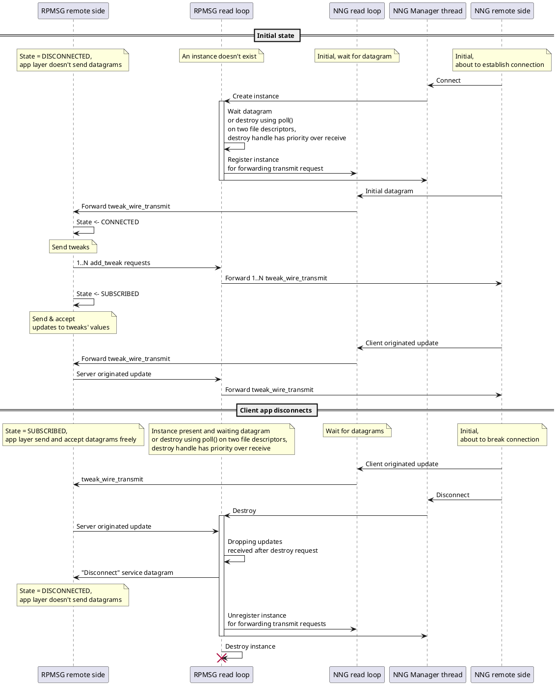

```plantuml
@startuml
participant "RPMSG remote side"
participant "RPMSG read loop"
participant "NNG read loop"
participant "NNG Manager thread"
participant "NNG remote side"

== Initial state ==

note over "RPMSG remote side": State = DISCONNECTED,\napp layer doesn't send datagrams
/ note over "RPMSG read loop": An instance doesn't exist
/ note over "NNG read loop": Initial, wait for datagram
/ note over "NNG remote side": Initial,\nabout to establish connection

"NNG remote side" -> "NNG Manager thread": Connect
"NNG Manager thread" -> "RPMSG read loop": Create instance
activate "RPMSG read loop"
"RPMSG read loop" -> "RPMSG read loop": Wait datagram\nor destroy using poll()\non two file descriptors,\ndestroy handle has priority over receive
"RPMSG read loop" -> "NNG read loop": Register instance\nfor forwarding transmit request
"RPMSG read loop" -> "NNG Manager thread"
deactivate "RPMSG read loop"
"NNG remote side" -> "NNG read loop": Initial datagram
"NNG read loop" -> "RPMSG remote side": Forward tweak_wire_transmit
"RPMSG remote side" -> "RPMSG remote side": State <- CONNECTED
note over "RPMSG remote side": Send tweaks
"RPMSG remote side" -> "RPMSG read loop": 1..N add_tweak requests
"RPMSG read loop" -> "NNG remote side": Forward 1..N tweak_wire_transmit
"RPMSG remote side" -> "RPMSG remote side": State <- SUBSCRIBED
note over "RPMSG remote side": Send & accept\nupdates to tweaks' values
"NNG remote side" -> "NNG read loop": Client originated update
"NNG read loop" -> "RPMSG remote side": Forward tweak_wire_transmit
"RPMSG remote side" -> "RPMSG read loop": Server originated update
"RPMSG read loop" -> "NNG remote side": Forward tweak_wire_transmit

== Client app disconnects ==

note over "RPMSG remote side": State = SUBSCRIBED,\napp layer send and accept datagrams freely
/ note over "RPMSG read loop": Instance present and waiting datagram\nor destroy using poll() on two file descriptors,\ndestroy handle has priority over receive
/ note over "NNG read loop": Wait for datagrams
/ note over "NNG remote side": Initial,\nabout to break connection

"NNG remote side" -> "NNG read loop": Client originated update
"NNG read loop" -> "RPMSG remote side": tweak_wire_transmit
"NNG remote side" -> "NNG Manager thread": Disconnect
"NNG Manager thread" -> "RPMSG read loop": Destroy
activate "RPMSG read loop"
"RPMSG remote side" -> "RPMSG read loop": Server originated update
"RPMSG read loop" -> "RPMSG read loop": Dropping updates\nreceived after destroy request
"RPMSG read loop" -> "RPMSG remote side": "Disconnect" service datagram
note over "RPMSG remote side": State = DISCONNECTED,\napp layer doesn't send datagrams
"RPMSG read loop" -> "NNG read loop": Unregister instance\nfor forwarding transmit requests
"RPMSG read loop" -> "NNG Manager thread"
deactivate "RPMSG read loop"
"RPMSG read loop" -> "RPMSG read loop" !! : Destroy instance

@enduml
```
